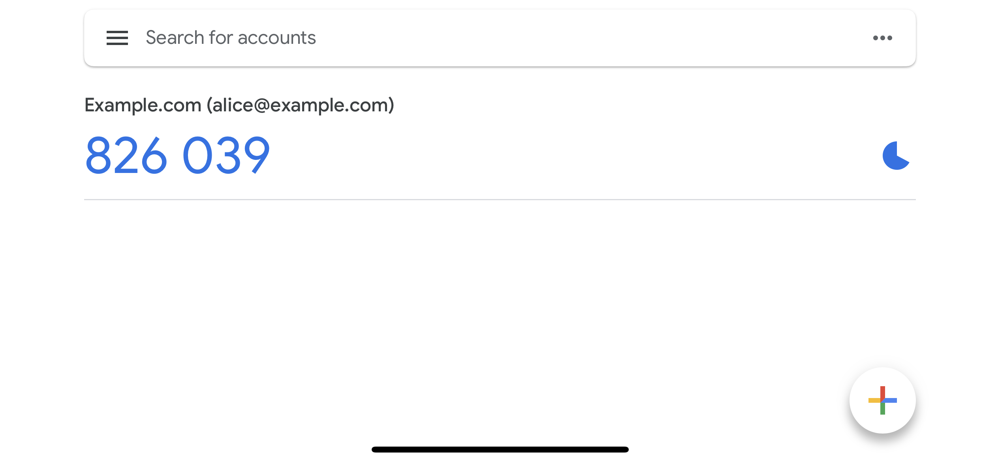

Ory Kratos support two-factor authentication. Depending on the flow, you might
want to call this two-factor verification depending on which features you have
enabled. Learn more about the distinction between two-factor authentication and
two-factor verification in this excellent
[1password](https://blog.1password.com/totp-for-1password-users/) blog post!

There are four key components available in Ory Kratos with regard to
multi-factor authentication. For this guide, we will assume that you are using
the Ory Cloud Managed UI available at
[github.com/ory/kratos-selfservice-ui-node](https://github.com/ory/kratos-selfservice-ui-node).
At the end of this guide you will find details and ideas on how to implement
your own UI with Ory Kratos' MFA features.

## Terminology

Before we start let's establish the key terminology to make the following
sections easier to understand!

### Authenticator Assurance Level (AAL)

The Authenticator Assurance Level (AAL) has two possible values:

- `aal1`: Implies that the identity has completed only one authentication factor
  (`password`, `oidc`).
- `aal2`: Implies that the identity has completed the first (`password`, `oidc`)
  and the second (`totp`, `lookup_secrets`, `webauthn`) authentication factor
  (e.g.: `password` + `totp`, `oidc` + `webauthn`, ...). First authentication
  factors can not be combined to gain `aal2` (e.g. `password` + `oidc` = `aal1`,
  not `aal2`)!

### Authentication Method Reference (AMR)

The Authentication Method Reference (AMR) is an array of authentication methods
that were used over the lifetime of an Ory Session. In an Ory Session, this will
have the following layout:

```json5 title="Example Ory Session JSON Payload"
{
  id: '6b51a3f2-6a2c-4557-90a8-4e23de7072aa',
  active: true,
  // ...
  authenticator_assurance_level: 'aal2',
  authentication_methods: [
    {
      method: 'password',
      completed_at: '2021-10-14T09:37:53.872104Z'
    },
    {
      method: 'lookup_secret',
      completed_at: '2021-10-14T09:41:16.771859Z'
    }
  ]
  // ...
}
```

The methods can be one of `password`, `oidc`, `totp`, `webauthn`,
`lookup_secrets`. A method can be included more than once, for example when the
identity refreshes their Ory Session by re-authenticating with e.g. their
password:

```json5 title="Example Ory Session JSON Payload"
{
  id: '6b51a3f2-6a2c-4557-90a8-4e23de7072aa',
  active: true,
  // ...
  authenticator_assurance_level: 'aal2',
  authentication_methods: [
    {
      method: 'password',
      completed_at: '2021-10-14T09:37:53.872104Z'
    },
    {
      method: 'lookup_secret',
      completed_at: '2021-10-14T09:41:16.771859Z'
    },
    {
      method: 'password',
      completed_at: '2021-10-14T12:00:00.134567Z'
    }
  ]
  // ...
}
```

## Strict and Lax Multi-Factor Authentication

Before jumping into the concrete MFA modules, we take a lok at "Soft
Multi-Factor Authentication". Ory Kratos has two endpoints which require an Ory
Session Token or Ory Session Cookie to function:

- [`/sessions/whoami`](../reference/api.mdx#operation/toSession)
- The [self-service setting flow](../self-service/flows/user-settings.mdx)

When you enable one of the 2FA methods, you can configure when an Ory Session
Token or Ory Session Cookie is considered "valid" for these two endpoints:

```yaml title="kratos.config.yml"
# ...
selfservice:
  flows:
    settings:
      required_aal: aal1
# ...
session:
  whoami:
    required_aal: aal1
# ...
```

The field `required_aal` can be one of:

- `highest_available` (default): If set, requires identities who have set up a
  second factor (e.g. `totp`, `webauthn`) to have an Ory Session where both
  factors (e.g. `password` + `totp`) have been used to authenticated.
- `aal1`: Even if an identity has a second factor set up, an Ory Session with
  only one factor (e.g. `oidc`, `password`) is enough to access it.

For example, if you want your users to sign in without forcing the second
factor, you could set:

```yaml title="kratos.config.yml"
# ...
session:
  whoami:
    required_aal: aal1
# ...
```

When the user is doing something that needs more security (e.g. a bank
transfer), you could add a check which only allows Ory Sessions that have `aal2`
to access that feature.

The Ory Session, which you can get by calling the
[`/sessions/whoami`](../reference/api.mdx#operation/toSession) endpoint,
contains the session's `authenticator_assurance_level`. For a session which only
completed the first factor, this would be:

```json5 title="GET /session/whoami"
{
  id: '6b51a3f2-6a2c-4557-90a8-4e23de7072aa',
  active: true,
  // ...
  authenticated_at: '2021-10-14T09:37:53.877216Z',
  authenticator_assurance_level: 'aal1'
  // ...
}
```

A session that has completed the second factor, this would be:

```json5 title="GET /session/whoami"
{
  id: '6b51a3f2-6a2c-4557-90a8-4e23de7072aa',
  active: true,
  // ...
  authenticated_at: '2021-10-14T09:37:53.877216Z',
  authenticator_assurance_level: 'aal2'
  // ...
}
```

## Time-Based One-Time Password (TOTP) / Authenticator App

Time-Based One-Time Password (TOTP) is a standardized algorithm (see
[RFC6238](https://datatracker.ietf.org/doc/html/rfc6238)) that is used by apps
supported by apps like Google Authenticator
([iOS](https://apps.apple.com/us/app/google-authenticator/id388497605),
[Android](https://play.google.com/store/apps/details?id=com.google.android.apps.authenticator2)),
[1Password](https://support.1password.com/one-time-passwords/),
[Bitwarden](https://bitwarden.com/help/article/authenticator-keys/), and many
others.



You can enable TOTP in your Ory Kratos config:

```yaml title="kratos.config.yml"
selfservice:
  methods:
    totp:
      enabled: true
      config:
        # The issuer (e.g. a domain name) will be shown in the TOTP app (e.g. Google Authenticator). It helps the user differentiate between different codes.
        issuer: Example.com
```

To help the user identify the correct code in their TOTP authenticator app, you
should set the `issuer` (see code example above) to your brand name or domain
name. However, users might have multiple identities registered in your system.
To help them distinguish between them, you can specify a traits in your Identity
Schema which should be the TOTP account name (in the screenshot above
`alice@example.org`):

```json5 title="identity.schema.json"
{
  $schema: 'http://json-schema.org/draft-07/schema#',
  type: 'object',
  properties: {
    traits: {
      type: 'object',
      properties: {
        email: {
          type: 'string',
          format: 'email',
          title: 'Your E-Mail',
          minLength: 3,
          'ory.sh/kratos': {
            credentials: {
              // ...
              totp: {
                account_name: true
              }
            }
            // ...
          }
        }
        // ...
      }
      // ...
    }
  }
}
```

## Lookup Secrets

- explain that secrets can be used once
- add warning that look up secrets are not regenerated if the user has used all
  of them

## WebAuthn

## Build Your Own UI
